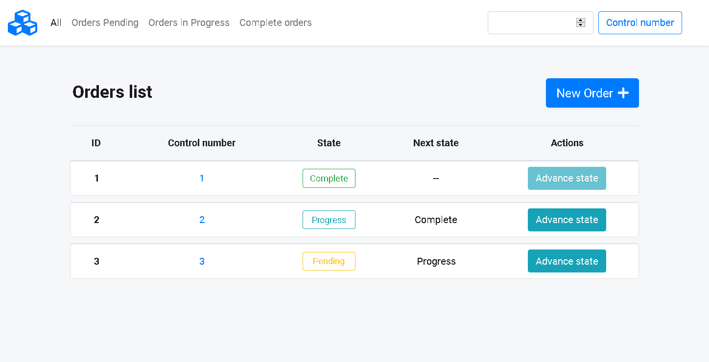

# [Orders App](https://floating-forest-15317.herokuapp.com/orders)

This Orders web app allows the user to create and update the state of orders from:

- Pending

- Progress

- Complete

If at the creation of an Order no control number is assigned to an order it will take the id number as its control number.

It's possible to filter the orders by state, clicking at the nav links or at the state button of each row, and by control number via the input at the navbar or direct click at the orders control number at the row.

## Built with

- Rails

- Bootstrap

- Heroku

## Visit

Deployed with Heroku at [link](https://floating-forest-15317.herokuapp.com/orders)
